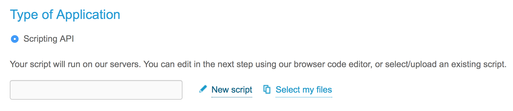

# Tropo script

**The Tropo script is a work in progress and does not work as is.**

[Tropo](tropo.com) is a cloud API for voice and SMS messaging.
The ED QOS Tropo plugin is intended to allow the user to interface with
the ED QOS app via SMS messages, to issue commands like:
`set relevance facebook Business-Relevant`

## Development
To develop on Tropo, you must register for a **free** Tropo account:
https://www.tropo.com/register

Create a new application and use the "Scripting API" and select "New script"


In the dialog box, you can paste the contents of edqos_text.py
**Be sure to change the tropo flag to true**

```
# Change me to True if you are deploying/testing on Tropo
tropo = False
```
